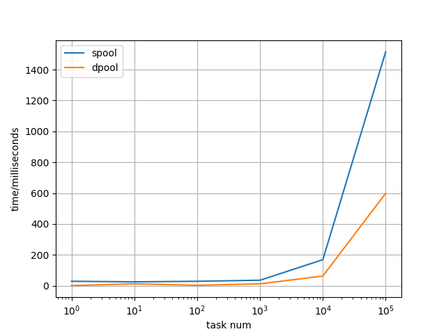
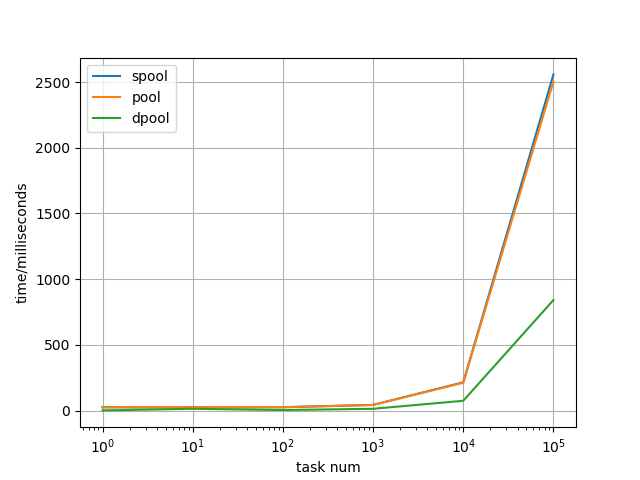
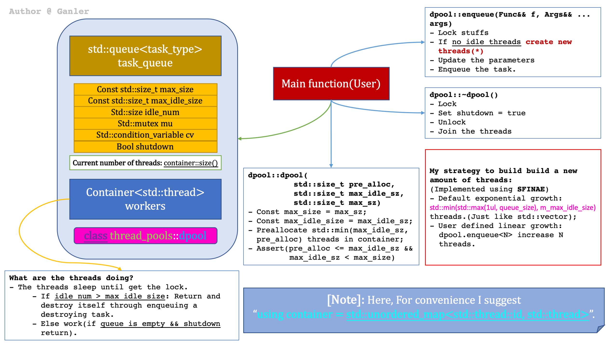
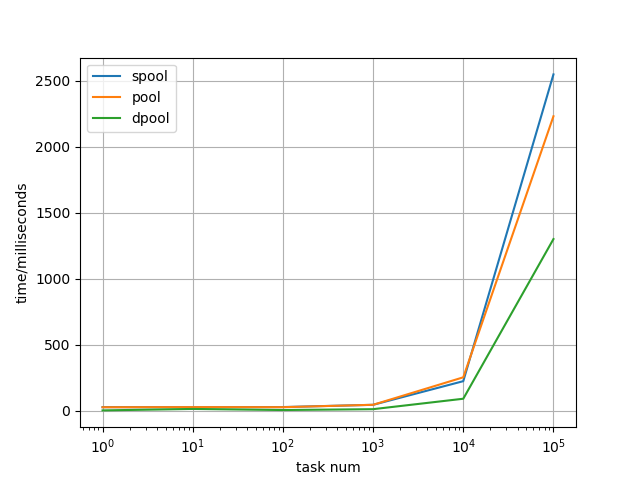
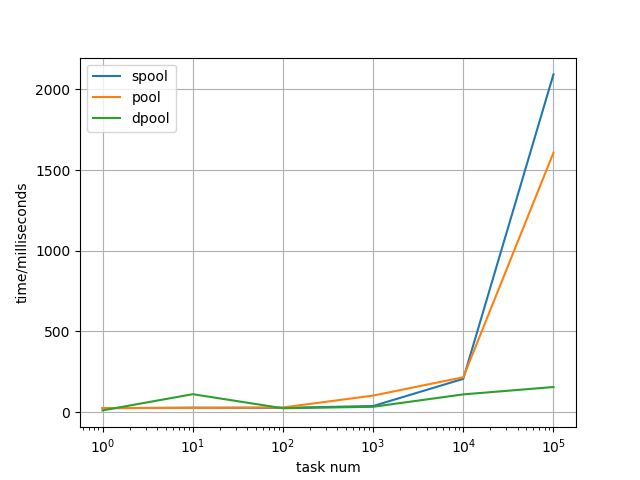

# Thread Pool Library

 


> Note that I rewrite this library and removed all thread containers(use detached threads instead). Hence, `default_pool`(in old version) is no longer needed.

> **BIRTHDAY UPDATE**
>
> Currently I am making a bigger optimized attempt:
>
> - Old version: We hold threads in some kinds of container(*Dynamic/static allocation*). We produce threads and join(*main thread's waiting*) them finally. I have to commit that what I did is kind of stupid.
> - New version: **I dropped all kinds of containers**.(Detach them once created. Now it's ***container-free***). Okay, you may ask what if the objects(like task quue) are destoryed in the stack. Fine, let's use heap memory managed by a `std::shared_ptr`. This is brillient and low-cost(If you want accuracy, a thread-safe container is a must), as writes to atomic variables happends only when the threads is going dead(And last dying thread will destroy the sources).
>
> > Now I've implemented this idea on my `static_pool`(And I deprecated `default_pool` as we need no longer thread containers).  `static_pool` in this new version is 31.8%(see more details in benchmark section below) faster than old version(as it's more "wait-free" and memory-saving). Optimized version of `dynamic_pool` will be released later(as its logic is more complex). : ).

## Quick Start

```c++
#include <thread_pool.hpp>
#include <iostream>

int main()
{
    thread_pool::static_pool<10> pool;
    // thread_pool::dynamic_pool pool;     // dynamic pool

    auto result = pool.enqueue([]() { return 2333; });
    std::cout << result.get() << '\n';
}
```

## Introduction

In the last 2 days, I implemented 2 kinds of thread pools:
- **thread_pool::static_pool**: Static pool which holds fixed number of threads.
- **thread_pool::dynamic_pool**: Dynamic pool which holds unfixed number of threads(This is very efficient).

These kinds of pools can be qualified with different tasks according to user's specific situations.

However, I myself design the growing strategy of the dynamic pool. For a `dynamic_pool(J, I, K)`:

- Dynamically adapt to the task size;
- The total threads are no more than K(Set by the user);
- The number of idle threads are no more than I(Set by the user);
- Create J threads when constructing.(Please make sure: J <= I && I < K && K > 0, or there will be a `std::logic_error`)

## APIs

### Initialization
```c++
using thread_pool

// Static pool:
constexpr std::size_t N = 10;
static_pool pool(N);                  // N is the number of threads this pool holds.
                                // Threads are created when construction function is called and destroyed when deconstruction function is called.

// Dynamic pool:
dynamic_pool(std::size_t = 2 + std::thread::hardware_concurrency(), std::size_t = no_input);
                                // The first parameter means the `max number of threads` it can have.
                                // The second parameter means the `max number of idle threads` it can have.
                                // The second parameter is 1/2 of the first one by default.

```

### Add tasks

```c++
// For any pool.
pool.enqueue(Func, Args...);
                                // The parameters are just the same as that of std::bind.
                                // See https://en.cppreference.com/w/cpp/utility/functional/bind for more details.

// For dynamic_pool.
pool.enqueue(Func, Args...);    // When there's no idle threads, increase the number of threads adaptively. 
                                // added = std::min({m_task_queue.size(), m_max_idle_size, m_max_size - m_workers.size()})

pool.enqueue<N>(Func, Args);    // When you give it a template parameter, you can add threads number linearly.
                                // added = std::min(Sz, m_max_idle_size)
```

### Run time information

```c++
// Only for dynamic_pool
std::size_t current_threads();  // Number of threads alive.
std::size_t current_tasks();    // Number of tasks in the task queue.(which haven't been excuted.)
```

## How and When to Use Thread Pool to Boost Performance

I highly recomment you to read [**Herb Sutter:Use Thread Pools Correctly: Keep Tasks Short and Nonblocking**](http://www.drdobbs.com/parallel/use-thread-pools-correctly-keep-tasks-sh/216500409).

## Advantages

- **Header-only**: Just move the .hpp file you to ur project and run.
- **Easy to use**: Just 2 API: Constructor and enqueue.
- **Easy to learn**: I tried to use lines as few as possible to make my code concise. Not only have I added some significant comments in the code, but I've drawn a figure to show u how I designed the dynamic pool as well. Good for guys who want to learn from my code.
- **High performance**: The results of the benchmark have shown this.

## Benchmark

```shell
mkdir build && cd build
cmake .. && make -j4 && ./thread_pool
```

Copy the output python script and run it. You can see the results.
(Note that each task cost 1m. For each pool, it can at most create `psize` threads to finish `mission_sz` tasks.)

> Benchmark of new version. For 10000 tasks, `static_pool`'s performance has boosted by about **31.8%** ((2200-1500)/2200).



> Benchmark of old version.



## How I Designed the Dynamic Pool



## Task and pointers

For most thread pool library, they use `std::shared_ptr` pointer to manage the `std::packaged_task<...>`. This is not efficient as it allocation more memory for 2 atomic counter. And C++ standard made old C++ versions(C++11 and former C++14)'s unique_ptr not compile when enqueuing such tasks. Hence I decided to use raw pointers with some exception code to boost the performance.

After removing the shared_ptr. The performance has been boosted by about 20%~30%.

See my comments on `static_pool::enqueue` in static_pool.hpp for more details.

Old shared_ptr version's performance:



## When Should You Use the Dynamic Pool

Mainly 2 situations:

- The amount of tasks are usually unknown.
- Your task running time is short(less than 3ms).

> This comes to the benefits of my dynamic pool:
> `dynamic_pool` can be very fast when each task's run time is short, as `dynamic_pool` create and destroy threads very fast.
> `dynamic_pool` can also be very fast when `task_num << max_size_of_the_pool`, as it will dynamically change the thread size.

Note that: **All the three pools will be the nearly same performance level** when your task scale is:

- Each task cost a relative long time(much longer than creating and destroying the threads).
- Your amount of task is much bigger than that of your threads.

To show this, I tested their performance where each task cost 10ms(bigger than original 1ms):



## TODOS

- Thread pool that holds fixed kind of functions. (Reduce dynamic allocation when std::function<void()> SOO cannot work)
- Lock-free thread pool.
- Comparision with other libraries.
